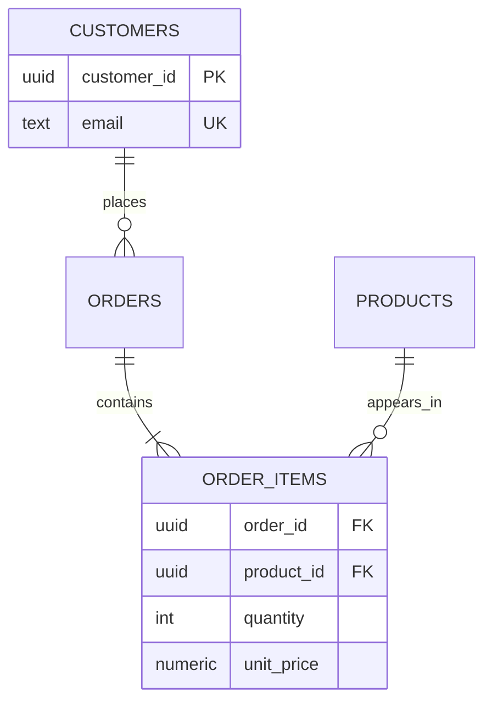

# Data Modeling & Database Design - Interview Master Guide

> A Staff+ revision guide reconstructed from the supplied handwritten notes. It preserves the notes' core themes - entities, attributes, keys, normalization, ACID/WAL, cardinality, schema design, and SQL internals - and adds production-grade nuance where a note was simplified.

## Table of Contents

- [1. Core concepts from the notes](#1-core-concepts-from-the-notes)
- [2. Missing-but-critical senior concepts](#2-missing-but-critical-senior-concepts)
- [3. Senior developer case-study dry runs](#3-senior-developer-case-study-dry-runs)
- [4. Final revision checklist](#4-final-revision-checklist)

## How to use this guide

For every concept, first say the **trap**, then state the trade-off, then anchor it with the example. The notes sometimes use "RDBMS automatically does X" as shorthand. In production, the exact behavior depends on the engine, isolation level, constraints, configuration, and application protocol.

## 1. Core Concepts from the Notes

### 1.1 Data modeling, databases, and DBMSs

**The FALSE Statement (The Trap):** A database is just an Excel sheet with more rows.

**The TRUE Statement (The Wisdom):** A database is a managed collection of related data; a **DBMS** adds constraints, concurrency control, recovery, security, indexing, and query planning. Data modeling turns business facts and rules into entities, attributes, relationships, and invariants that the DB can enforce.

**The UNFORGETTABLE Example:** A student spreadsheet can list `batch_id=AC1` even when no AC1 batch exists. A relational schema rejects that orphan through a foreign key before the bad value becomes reporting debt.

**The Interview Soundbite:** "I model facts and invariants, not screens. Tables are the persistence representation; constraints, ownership, and lifecycle rules are what make the model trustworthy under concurrency."

### 1.2 Entities, entity types, and attributes

**The FALSE Statement (The Trap):** Every noun in a requirement becomes one table, and every property belongs in that table.

**The TRUE Statement (The Wisdom):** An **entity** is one distinguishable business object; an **entity type** is its class (for example, `Product`); attributes describe it. Put a fact on the entity that owns its meaning. Extract a separate entity when it has its own identity, lifecycle, many values, or relationships.

**The UNFORGETTABLE Example:** A grocery product has price and available quantity. An address may look like one field, but city, postal code, and country become separate attributes when shipping, validation, and taxation need them.

**The Interview Soundbite:** "I start with business invariants and lifecycle. If a value can be independently queried, changed, or related, it is a candidate entity rather than a comma-separated attribute."

| Attribute type in the notes | Design implication |
| --- | --- |
| Simple / atomic | Store one queryable value per column, such as `name`. |
| Composite | Split `address` when sub-parts are required; otherwise preserve the domain object. |
| Single-valued | `date_of_birth` belongs on `users`. |
| Multi-valued | Model phone numbers/emails in child tables when multiple values are real. |
| Derived | Prefer computing age from DOB; cache only with an invalidation owner. |

### 1.3 Keys: super, candidate, primary, foreign, and surrogate

**The FALSE Statement (The Trap):** A primary key is merely an ID column, and all unique combinations are equally good keys.

**The TRUE Statement (The Wisdom):** A **superkey** uniquely identifies a row but may have redundant columns. A minimal superkey is a **candidate key**. Pick one candidate key as the **primary key**; it must be unique and non-null. A **foreign key** enforces a relationship to a candidate/primary key. Production systems often use a narrow immutable surrogate key plus a `UNIQUE` business key.

**The UNFORGETTABLE Example:** `student_id`, `roll_no`, and verified `email` may each be candidate keys. `student_id + roll_no + email` is a superkey but is needlessly wide. Reusing mutable email as every foreign key makes a rename fan out across the system.

**The Interview Soundbite:** "I use a stable, narrow surrogate identifier for joins and retain the business identity as a unique constraint. Natural keys are excellent constraints; they are risky primary keys when they can change or are wide."

⚠️ **Correction to a simplified note:** Integer keys are not universally best. Random UUIDs can fragment clustered B-tree layouts; ordered UUIDv7/ULID-like identifiers reduce that cost and are useful when IDs must be generated across regions. Measure the database and workload.

### 1.4 Relationships and cardinality

**The FALSE Statement (The Trap):** A relationship is represented by drawing a line; the database will infer its rules.

**The TRUE Statement (The Wisdom):** Specify both **cardinality** and **optionality**. A 1:1 relationship is usually a foreign key plus `UNIQUE`; a 1:N relationship puts the FK on the many side; an M:N relationship requires an associative table. A relationship may carry its own facts, which makes that associative table a first-class entity.

**The UNFORGETTABLE Example:** An order contains many products and a product appears in many orders. `order_items(order_id, product_id, quantity, unit_price)` captures the relationship and preserves the price paid, not today's catalog price.

**The Interview Soundbite:** "For every edge I ask: how many, is it optional, where does the FK live, and does the relationship itself have attributes? That last question is why M:N nearly always becomes a table."



### 1.5 Schema-design workflow

**The FALSE Statement (The Trap):** Start drawing columns immediately, then add relationships later.

**The TRUE Statement (The Wisdom):** Use the notes' two-step method: extract nouns and facts, then map relationships and constraints. First ask how data is created, read, changed, retained, and deleted. Separate lookup/reference data (for example, `batch_types`) from mutable operational records; avoid magic strings that create typos and inconsistent updates.

**The UNFORGETTABLE Example:** For a training platform: batches, students, classes, instructors, mentors, organizations, universities, batch history, and mentor sessions emerge from requirements. A student's batch transfer is not overwriting `batch_id`; it is a dated `student_batch_history` record.

**The Interview Soundbite:** "I convert requirements into nouns, verbs, cardinalities, constraints, and temporal rules. The schema comes last, after I know which facts must remain true and which histories are legally or operationally important."

<details>
<summary>Schema design checklist from the notes, refined for production</summary>

1. Clarify scope, read/write paths, SLAs, retention, tenancy, and failure modes.
2. Identify entities and assign every fact an owner; use singular attributes and consistent plural table names.
3. Add stable PKs, `NOT NULL`, `UNIQUE`, `CHECK`, FK, and exclusion constraints where appropriate.
4. Model 1:1/1:N with FKs and M:N with associative tables; record history rather than overwrite historical facts.
5. Normalize first; add indexes from observed query shapes; denormalize only with an owner and repair path.
6. Test migrations, concurrency, access control, backup/recovery, and explain plans with realistic data.
</details>

### 1.6 Normalization and 3NF

**The FALSE Statement (The Trap):** Normalization is academic splitting; more tables always make queries slower.

**The TRUE Statement (The Wisdom):** Normalization removes avoidable duplication and update anomalies. The notes' 3NF example is a transitive dependency: in `student_enrollment(student_id, course_id, instructor_id, instructor_name)`, `course_id -> instructor_id -> instructor_name`. Move instructor data to its owning relation, while retaining the intended enrollment facts. Joins are often cheaper than inconsistent repair work.

**The UNFORGETTABLE Example:** If an instructor's name changes, a denormalized enrollment table needs millions of updates. If one batch misses the job, two "truths" appear in transcripts and support tickets.

**The Interview Soundbite:** "Normalize until each fact has one authoritative owner, then deliberately denormalize hot read models. 3NF prevents non-key attributes from determining other non-key attributes in the same relation."

### 1.7 Constraints, consistency, and CRUD

**The FALSE Statement (The Trap):** If the API validates input, the database does not need constraints.

**The TRUE Statement (The Wisdom):** Application validation improves UX; database constraints protect every writer: jobs, admin scripts, migrations, retries, and future services. `NOT NULL`, FK, `UNIQUE`, `CHECK`, and correctly scoped transactions turn business invariants into executable policy.

**The UNFORGETTABLE Example:** A UI validates age, but an import bypasses it. `CHECK (age >= 20)` rejects impossible rows. For balance transfers, the database can enforce shape and atomicity; an application/domain rule decides the business meaning.

**The Interview Soundbite:** "The database cannot infer my domain rules, but it can enforce the rules I encode. I validate twice: friendly validation at the boundary and authoritative invariants at persistence."

### 1.8 ACID, transactions, WAL, and recovery

**The FALSE Statement (The Trap):** ACID means every microservice operation is globally all-or-nothing.

**The TRUE Statement (The Wisdom):** ACID applies to a database transaction under the selected engine and isolation semantics. **Atomicity** is all-or-nothing, **consistency** is preservation of declared invariants, **isolation** controls concurrent visibility, and **durability** means acknowledged committed work survives the promised failure model. A **write-ahead log (WAL)** records enough information before data pages are made durable, enabling redo/undo and crash recovery; checkpoints bound recovery work.

**The UNFORGETTABLE Example:** Before changing a student's cohort, the engine logs the change, then updates the data page. A crash after the log but before the page can be recovered by replaying the log; an uncommitted change is rolled back/ignored according to the engine's recovery protocol.

**The Interview Soundbite:** "A transaction is a consistency boundary, not a distributed magic wand. WAL makes recovery possible because durable log records precede the durable data-page effects; commit acknowledgement depends on the configured durability guarantee."

### 1.9 Isolation levels and concurrency anomalies

**The FALSE Statement (The Trap):** Isolation means transactions cannot run at the same time.

**The TRUE Statement (The Wisdom):** Concurrent work is necessary. Isolation defines the anomalies permitted: dirty reads, non-repeatable reads, phantoms, lost updates, and write skew vary by engine and level. `READ COMMITTED` is common, but its exact implementation differs. Higher isolation can add aborts, locks, or version-storage pressure.

**The UNFORGETTABLE Example:** Two users both see one remaining seat and each decrement it. Without a conditional update, lock, or serializable conflict detection, both may sell it. `UPDATE inventory SET available=available-1 WHERE sku=$1 AND available>0` plus checking the row count protects the invariant.

**The Interview Soundbite:** "I select isolation from the invariant, not a slogan. For scarce inventory I use an atomic conditional write or a short lock, idempotency, and retries; serializable correctness may still require retrying transaction aborts."

### 1.10 Soft deletes, history, and referential integrity

**The FALSE Statement (The Trap):** Add `is_active` and deletion is solved.

**The TRUE Statement (The Wisdom):** A soft delete preserves a row for audit, restore, or legal retention, but every query, unique constraint, FK rule, cache, and analytics job must respect its lifecycle. Hard deletes reduce data and privacy risk but may violate retention/audit needs. Historical references often need a status/tombstone or immutable snapshot rather than silently disappearing.

**The UNFORGETTABLE Example:** An order references a customer who requests account deletion. Hard-deleting the customer may break order history. Retain a minimal, access-controlled tombstone/pseudonym where lawful, remove unnecessary PII, and filter active customer lists with `deleted_at IS NULL`.

**The Interview Soundbite:** "Soft delete is not a boolean; it is a data-lifecycle policy. I decide retention, restoration, legal erasure, query defaults, partial unique indexes, and what dependent history is allowed to reference."

### 1.11 Indexes, query plans, joins, aggregation, and sorting

**The FALSE Statement (The Trap):** Create an index on every column, and an indexed predicate always causes an index scan.

**The TRUE Statement (The Wisdom):** An index is a separate structure that speeds qualifying read paths at the cost of writes, space, cache, and maintenance. The optimizer can choose a table scan when selectivity is poor or statistics say it is cheaper. B-tree indexes support ordered/range work; sorting or grouping may require memory/disk spills. Joins can be nested-loop, hash, or merge joins based on sizes, indexes, memory, and estimates.

**The UNFORGETTABLE Example:** An index on `hire_date` helps a narrow date range, but querying 80% of employees is often faster as a sequential scan. `ORDER BY salary` without a useful index may sort millions of rows; an index matching the access path can avoid that work.

**The Interview Soundbite:** "Indexes are workload-specific materialized access paths. I inspect `EXPLAIN (ANALYZE)`, cardinality estimates, selectivity, and write cost instead of forcing a plan or blindly indexing every filter."

⚠️ `WHERE` filters rows before grouping; `HAVING` filters groups after aggregation. SQL result order is unspecified without an explicit `ORDER BY`.

## 2. Missing-but-Critical Senior Concepts

The supplied notes introduce 3NF, basic ACID, simple indexes, relationships, soft deletes, and vertical/horizontal scaling. The following **18 extensions** fill interview-critical gaps. Each uses the same FALSE -> TRUE method.

### 2.1 1NF, 2NF, BCNF, and practical normalization

**The FALSE Statement (The Trap):** 3NF is the only normal form worth knowing.

**The TRUE Statement (The Wisdom):** **1NF** removes repeating groups/ambiguous multi-values; **2NF** removes partial dependency on part of a composite key; **3NF** removes non-key transitive dependency; **BCNF** requires every determinant to be a candidate key. BCNF can sacrifice dependency preservation, so 3NF is often the pragmatic target.

**The UNFORGETTABLE Example:** `enrollment(student_id, course_id, student_name)` violates 2NF because `student_id -> student_name`; a course coordinator duplicated across class rows creates a 3NF problem.

**The Interview Soundbite:** "Normalization is about functional dependencies and update anomalies. I target 3NF by default, consider BCNF for stubborn anomalies, and only denormalize after naming the read workload and repair source."

### 2.2 Deliberate denormalization

**The FALSE Statement (The Trap):** Denormalization means copying columns because joins feel scary.

**The TRUE Statement (The Wisdom):** Denormalize only for measured latency, cost, or availability needs, with one authoritative source, refresh semantics, reconciliation, and observability. Common forms are immutable snapshots, materialized views, counters, precomputed timelines, and search projections.

**The UNFORGETTABLE Example:** Store `order_items.unit_price` as a contractual purchase-time snapshot; do not copy mutable catalog price into every order merely for convenience.

**The Interview Soundbite:** "I normalize the write model and denormalize read models intentionally. Every duplicated fact must have an owner, a refresh mechanism, and a failure/rebuild plan."

### 2.3 Composite, covering, partial, and hash indexes

**The FALSE Statement (The Trap):** An index on `(a, b)` is equivalent to two single-column indexes.

**The TRUE Statement (The Wisdom):** Column order follows equality filters, ranges, sorting, and selectivity; a B-tree composite index generally supports its leftmost prefix. A **covering** index can satisfy a query without table lookup when supported. A **partial** index targets a stable subset. Hash indexes are specialized equality structures and are not a universal replacement for B-trees.

**The UNFORGETTABLE Example:** A feed query `WHERE user_id=? AND created_at<? ORDER BY created_at DESC LIMIT 50` wants `(user_id, created_at DESC)`; indexing `created_at` alone makes each user's lookup expensive.

**The Interview Soundbite:** "I index query shapes, not columns. I start with the equality prefix, then range/order requirements, validate via the plan, and account for every index's write amplification."

### 2.4 ACID versus BASE

**The FALSE Statement (The Trap):** BASE is an inferior version of ACID.

**The TRUE Statement (The Wisdom):** ACID protects local transactional invariants. **BASE** (basically available, soft state, eventual consistency) is a distributed-system availability trade-off for replicas/caches/async projections. Many real systems combine them: an ACID order DB plus eventually consistent search and analytics.

**The UNFORGETTABLE Example:** Checkout must not charge twice, so its ledger uses transactions and idempotency. The "orders shipped today" dashboard can lag by seconds.

**The Interview Soundbite:** "Consistency is per invariant and per boundary. I keep money and inventory decisions strongly consistent where needed, and let derived views converge when user value tolerates staleness."

### 2.5 CAP and replica consistency in practice

**The FALSE Statement (The Trap):** CAP lets a system choose any two of consistency, availability, and partition tolerance.

**The TRUE Statement (The Wisdom):** During a network partition, a distributed system chooses whether a given operation rejects/blocks to preserve a consistency contract (**CP**) or responds with potentially stale/divergent data (**AP**). Partition tolerance is not optional for systems spanning unreliable links. Normal operation has more nuanced latency/consistency choices.

**The UNFORGETTABLE Example:** A bank may reject a cross-region balance update when quorum is unavailable; a social feed may serve the last replicated timeline and heal later.

**The Interview Soundbite:** "CAP is about behavior during partitions, not a permanent two-of-three shopping list. I state the invariant, tolerated staleness, quorum/leader policy, and user-visible fallback."

### 2.6 Optimistic and pessimistic locking

**The FALSE Statement (The Trap):** Locks are always bad, so use optimistic locking everywhere.

**The TRUE Statement (The Wisdom):** **Optimistic locking** detects conflict using a version/CAS and retries; it shines when conflicts are rare. **Pessimistic locking** reserves rows while a short transaction runs; it suits scarce resources/high contention but risks blocking and deadlock.

**The UNFORGETTABLE Example:** Editing a profile uses `UPDATE profiles SET ..., version=version+1 WHERE id=? AND version=?`. Reserving the last concert seat uses a short row lock or atomic decrement.

**The Interview Soundbite:** "Choose by contention and critical-section duration. Optimistic means detect-and-retry; pessimistic means block-and-protect. Neither replaces unique constraints or idempotency."

### 2.7 Partitioning, sharding, and replication

**The FALSE Statement (The Trap):** Sharding and partitioning are just synonyms for splitting a table.

**The TRUE Statement (The Wisdom):** **Partitioning** splits data inside one logical database/table, often by time or range. **Sharding** routes data across independent nodes, adding cross-shard query and rebalancing complexity. **Replication** copies data for availability/read scale/DR and introduces lag or write-coordination choices.

**The UNFORGETTABLE Example:** Partition events by month for retention pruning; shard tenants by `tenant_id` only after a single cluster cannot meet capacity; replicate catalog reads geographically.

**The Interview Soundbite:** "Partition for manageability and pruning, replicate for availability/read locality, shard when a single write/compute boundary is exhausted. The shard key is a long-term product and operational decision."

### 2.8 OLTP, OLAP, and HTAP

**The FALSE Statement (The Trap):** One normalized production database should power every dashboard.

**The TRUE Statement (The Wisdom):** **OLTP** favors small, concurrent, integrity-sensitive transactions. **OLAP** favors large scans, aggregates, columnar storage, and dimensional models. **HTAP** combines or bridges both with careful isolation/resource governance; it is not a free lunch.

**The UNFORGETTABLE Example:** A checkout write must finish in milliseconds while a monthly revenue query scans billions of events. Run the latter on a warehouse/replica, not the payment primary.

**The Interview Soundbite:** "I separate transactional correctness from analytical throughput. Operational models are normalized around writes; analytical models are often denormalized stars around questions."

### 2.9 Event sourcing versus CRUD

**The FALSE Statement (The Trap):** Event sourcing is CRUD with an event table.

**The TRUE Statement (The Wisdom):** CRUD stores current state; **event sourcing** stores an append-only sequence of domain events and derives state. It brings audit/replay value but requires event-versioning, idempotent consumers, snapshots, and eventual-consistency thinking.

**The UNFORGETTABLE Example:** `OrderPlaced`, `PaymentAuthorized`, and `OrderCancelled` explain why an order is cancelled; overwriting `status='cancelled'` does not.

**The Interview Soundbite:** "Use event sourcing when history, replay, and domain causality are first-class. For ordinary mutable reference data, CRUD is simpler and usually safer."

### 2.10 CQRS

**The FALSE Statement (The Trap):** CQRS requires two databases and microservices.

**The TRUE Statement (The Wisdom):** **Command Query Responsibility Segregation** separates write intent from read models when their optimization needs differ. It can begin as separate code paths in one database; physical separation follows only when justified.

**The UNFORGETTABLE Example:** A merchant command validates and changes inventory; a customer product page reads a denormalized availability/search projection that may lag briefly.

**The Interview Soundbite:** "CQRS is a complexity trade: accept projection lag and operational machinery only when read and write shapes genuinely conflict."

### 2.11 Saga, 2PC, transactional outbox, and idempotency

**The FALSE Statement (The Trap):** A distributed transaction can be made reliable by retrying HTTP calls.

**The TRUE Statement (The Wisdom):** **2PC** offers coordination but can block and is operationally costly across autonomous services. A **Saga** composes local transactions with compensations. A **transactional outbox** writes domain state and an event record atomically, then reliably publishes it; consumers must be idempotent.

**The UNFORGETTABLE Example:** Order creation writes `orders` and `outbox` in one transaction. A relay publishes `OrderPlaced`; payment and inventory act idempotently, and a failed payment triggers a compensating release.

**The Interview Soundbite:** "Exactly-once end-to-end is rarely literal. I design at-least-once delivery with idempotency keys, durable outbox state, replay-safe consumers, and explicit compensation."

### 2.12 JSON and NoSQL modeling

**The FALSE Statement (The Trap):** JSON avoids schema design, and relational databases cannot model flexible data.

**The TRUE Statement (The Wisdom):** JSON is useful for sparse, evolving, document-shaped attributes; relational columns/relations win for keys, joins, constraints, and heavily queried fields. MongoDB embeds data with bounded co-access/lifecycle and references data with independent growth or many-to-many relationships. Index the queried JSON paths deliberately.

**The UNFORGETTABLE Example:** Keep `products(id, sku, price)` relational; store rarely filtered vendor-specific device specs in `specs JSONB`. Do not hide tenant ID or money amount only inside JSON.

**The Interview Soundbite:** "Flexible representation is not an excuse for flexible invariants. I normalize identity and critical predicates, use documents for bounded aggregates, and promote JSON fields when query frequency proves their value."

### 2.13 Temporal data and slowly changing dimensions

**The FALSE Statement (The Trap):** `updated_at` gives complete history.

**The TRUE Statement (The Wisdom):** Temporal modeling requires effective time (business validity) and sometimes system/recording time. **SCD Type 1** overwrites, **Type 2** inserts a dated version, and **Type 3** retains limited prior values. Exclusion/overlap constraints and immutable event/history tables prevent ambiguous periods.

**The UNFORGETTABLE Example:** A customer's billing address changed on March 1, but an invoice from February must render the prior address. Store an immutable invoice snapshot or a version valid at invoice time.

**The Interview Soundbite:** "History is a requirement, not a timestamp. I clarify whether we need current truth, as-of-business-time truth, audit time, or immutable transaction snapshots."

### 2.14 Connection pools and the N+1 query problem

**The FALSE Statement (The Trap):** More application connections make the database faster.

**The TRUE Statement (The Wisdom):** Connections consume memory and scheduler resources; pools bound concurrency and provide backpressure. **N+1** occurs when one list query triggers one follow-up query per item. Fix with joins, batched `IN` queries, prefetching, DataLoader-like batching, pagination, and measured result sizes.

**The UNFORGETTABLE Example:** Loading 100 orders then 100 customer queries turns one API call into 101 DB round trips. Fetch required customers in one join or batch.

**The Interview Soundbite:** "The database is not an infinite parallelism engine. I size pools against DB capacity, instrument wait time, and inspect endpoint query counts before optimizing SQL text."

### 2.15 Backward-compatible database migrations

**The FALSE Statement (The Trap):** Deploy a code change and `ALTER TABLE` together, then drop the old column.

**The TRUE Statement (The Wisdom):** Distributed deploys overlap versions. Use **expand-contract**: add nullable/new structure, deploy dual-read/write or backfill safely, validate, migrate readers, then remove old paths after compatibility windows. Avoid long locks and unbounded backfills in a primary transaction.

**The UNFORGETTABLE Example:** Replace `full_name` with `given_name`/`family_name`: add columns, backfill in batches, write both, switch reads, verify, stop old writes, then retire `full_name`.

**The Interview Soundbite:** "A migration is a multi-version protocol. I make each step deployable, reversible where possible, observable, and safe under old application binaries."

### 2.16 Backups, recovery objectives, and DR

**The FALSE Statement (The Trap):** Replication is a backup.

**The TRUE Statement (The Wisdom):** Replication can replicate corruption, bad deletes, and ransomware. Backups need retention, encryption, offsite/isolated copies, restore drills, and explicit **RPO** (acceptable data loss) and **RTO** (acceptable recovery time). WAL/archive logs can enable point-in-time recovery.

**The UNFORGETTABLE Example:** An operator deletes a table at 10:02. A replica faithfully deletes it too; only a tested point-in-time restore to 10:01 saves the data.

**The Interview Soundbite:** "A backup is only real if restore is tested. I state RPO/RTO, failure domains, immutable retention, and the runbook before claiming resilience."

### 2.17 Data security, privacy, and tenancy

**The FALSE Statement (The Trap):** Encrypting the disk completes data security.

**The TRUE Statement (The Wisdom):** Security requires least privilege, tenant authorization, encryption in transit/at rest, secrets management, audit logging, masking, retention/deletion policy, and protection against inference through logs/exports. Row-level security can be defense in depth, not a substitute for correct application authorization.

**The UNFORGETTABLE Example:** A shared SaaS database includes `tenant_id` in every tenant-scoped PK/FK/index and verifies tenant context on every query; an admin export is audited and PII-minimized.

**The Interview Soundbite:** "Tenant isolation is a schema, query, and operational concern. I design for least privilege and prove isolation with constraints, policies, tests, and auditability."

### 2.18 Observability and data quality

**The FALSE Statement (The Trap):** If the DB is up and queries return 200, the data system is healthy.

**The TRUE Statement (The Wisdom):** Measure latency, lock waits, deadlocks, replica lag, cache hit rate, slow queries, pool saturation, WAL/backup health, and business invariants. Data quality needs freshness, completeness, uniqueness, validity, reconciliation, and ownership.

**The UNFORGETTABLE Example:** A payment event consumer is healthy but silently skips a new event version. Infrastructure metrics look green; a reconciliation compares authorized payments to ledger entries and alarms on the gap.

**The Interview Soundbite:** "I observe both system health and truth health. The important dashboard pairs DB telemetry with domain reconciliation and actionable ownership."

## 3. Senior Developer Case-Study Dry Runs

### 3.1 Uber/Ola ride sharing

**Requirements clarification:** What latency for matching? Is location exact or approximate? Can a rider cancel after dispatch? How are surge snapshots, payments, safety audit, and driver availability retained?

**Naive schema (junior):** `rides(id, rider_id, driver_id, pickup, dropoff, price, status)` plus `drivers(location)`.

**Production-grade schema:** `riders`, `drivers`, `driver_sessions`, append-only `driver_location_events`, `ride_requests`, `ride_offers`, `trips`, `trip_status_events`, `surge_rules`, `fare_quotes`, `payment_attempts`, and immutable `ledger_entries`. A request owns its match attempts; a trip owns its lifecycle; the fare quote snapshots the pricing decision.

```sql
CREATE TABLE trip (
  id uuid PRIMARY KEY, rider_id uuid NOT NULL REFERENCES rider(id),
  driver_id uuid REFERENCES driver(id), request_id uuid NOT NULL UNIQUE,
  status text NOT NULL CHECK (status IN ('requested','assigned','started','completed','cancelled')),
  fare_quote_id uuid NOT NULL, created_at timestamptz NOT NULL DEFAULT now()
);
CREATE INDEX trip_rider_created_idx ON trip (rider_id, created_at DESC);
```

**Relationship mapping:** Rider 1:N trip; driver 1:N trip; trip 1:N status events/payment attempts; driver 1:N location events. Matching is not a direct FK assignment until an offer is accepted.

**Scaling and trade-offs:** Geo-search lives in an in-memory/geospatial serving path; canonical trips remain relational. Partition location/events by time and region; shard only on regional routing boundaries. Use atomic offer acceptance/version checks to avoid double assignment; outbox trip events feeds notifications. Do not update one mutable `driver_location` record if trip reconstruction matters.

**Outage prevented:** A fare snapshot and idempotency key prevent price recalculation/duplicate charge after retries; compare-and-set assignment prevents two riders getting the same driver.

### 3.2 Twitter/X news feed

**Requirements clarification:** Follow graph size? Celebrity fan-out? Delete/edit semantics? Ordering, privacy, ads, read freshness, and timeline SLA?

**Naive schema (junior):** `tweets(user_id, body)` and `follows(follower_id, followee_id)`; join them on every home request.

**Production-grade schema:** `users`, `follow_edges`, immutable `posts`, `post_media`, `visibility_rules`, `home_timeline_entries(user_id, post_id, score, created_at)`, and `fanout_jobs`. Keep post truth separate from per-user feed projections.

```sql
CREATE TABLE follow_edge (
  follower_id bigint NOT NULL, followee_id bigint NOT NULL,
  created_at timestamptz NOT NULL DEFAULT now(),
  PRIMARY KEY (follower_id, followee_id)
);
CREATE INDEX post_author_time_idx ON post (author_id, created_at DESC);
```

**Relationship mapping:** User M:N user via follows; user 1:N post; post 1:N media; user 1:N timeline entry. Timeline entries are derived, not authoritative posts.

**Scaling and trade-offs:** Fan-out on write gives fast reads for normal accounts; fan-out on read protects celebrity writes. Hybrid routing uses a follower-count threshold. Cache paginated feeds; use cursor pagination and tombstones/visibility filtering. Partition posts by time and shard by author or timeline owner.

**Outage prevented:** Bounded asynchronous fanout avoids a celebrity post synchronously writing to tens of millions of inboxes; idempotent entries avoid duplicate posts on retries.

### 3.3 WhatsApp/chat system

**Requirements clarification:** Delivery/read receipts per recipient? End-to-end encryption metadata boundaries? Offline retention, edit/delete rules, group size, ordering scope, and media lifecycle?

**Naive schema (junior):** `messages(sender_id, receiver_id, body, status)`.

**Production-grade schema:** `conversations`, `conversation_members`, `messages(conversation_id, sequence_no, sender_id, ciphertext, ...)`, `message_receipts(message_id, member_id, delivered_at, read_at)`, `media_objects`, and membership/audit events. Object storage keeps media; DB keeps metadata and authorization.

```sql
CREATE TABLE message (
  conversation_id uuid NOT NULL, sequence_no bigint NOT NULL,
  id uuid NOT NULL UNIQUE, sender_id uuid NOT NULL, ciphertext bytea NOT NULL,
  sent_at timestamptz NOT NULL, PRIMARY KEY (conversation_id, sequence_no)
);
CREATE INDEX message_sender_time_idx ON message (sender_id, sent_at DESC);
```

**Relationship mapping:** Conversation M:N users through membership; conversation 1:N messages; message M:N recipients through receipts.

**Scaling and trade-offs:** Sequence per conversation gives an ordering contract without pretending global order exists. Partition by conversation/time; hot groups need striped storage/queues. Use idempotency client IDs and cursor sync. Store receipt aggregates for very large groups rather than a row per read when product semantics permit.

**Outage prevented:** Per-conversation sequence and dedupe keys prevent retry duplicates/reordering; media blob separation keeps a large upload from locking transactional message delivery.

### 3.4 Amazon/e-commerce

**Requirements clarification:** Inventory reservation vs sale? Multi-warehouse fulfillment? Tax/pricing snapshots? Payment authorization/capture/refund reconciliation? Guest checkout and returns?

**Naive schema (junior):** `orders(user_id, product_id, quantity, total, status)`.

**Production-grade schema:** `catalog_products`, `skus`, `price_versions`, `inventory_balances`, `inventory_reservations`, `carts`, `orders`, `order_items`, `fulfillments`, `payment_intents`, `payment_attempts`, `refunds`, and double-entry `ledger_entries`. Snapshot unit price, tax, address, and product display facts on `order_items`.

```sql
CREATE TABLE inventory_reservation (
  id uuid PRIMARY KEY, sku_id uuid NOT NULL, order_id uuid NOT NULL UNIQUE,
  quantity int NOT NULL CHECK (quantity > 0), expires_at timestamptz NOT NULL
);
CREATE INDEX reservation_sku_expiry_idx ON inventory_reservation (sku_id, expires_at);
```

**Relationship mapping:** Order 1:N items/fulfillments/payment attempts; SKU 1:N inventory balances by warehouse; order 1:N ledger entries.

**Scaling and trade-offs:** Keep inventory allocation atomic per SKU/warehouse; do not trust a cached stock display as the final allocator. Partition orders by time, index customer history, and publish outbox events. Use a saga for payment/reservation/fulfillment, plus reconciliation with the payment provider.

**Outage prevented:** Reservation expiration and conditional inventory decrement prevent oversell; immutable payment attempts plus provider idempotency keys prevent double charge.

### 3.5 Netflix/video streaming

**Requirements clarification:** Regional rights, profiles, resume progress, recommendation freshness, concurrent-device rules, telemetry volume, and content deletion?

**Naive schema (junior):** `videos`, `users`, `watch_history(user_id, video_id, progress)`.

**Production-grade schema:** `titles`, `title_assets`, `availability_windows`, `entitlements`, `profiles`, `playback_sessions`, append-only `playback_events`, `progress_snapshots`, `recommendation_candidates`, and `experiments`. Content metadata is authoritative; recommendation and analytics stores are projections.

```sql
CREATE TABLE progress_snapshot (
  profile_id uuid NOT NULL, title_id uuid NOT NULL,
  position_ms bigint NOT NULL, updated_at timestamptz NOT NULL,
  PRIMARY KEY (profile_id, title_id)
);
CREATE INDEX availability_region_window_idx ON availability_window (region, starts_at, ends_at);
```

**Relationship mapping:** Account 1:N profiles; title 1:N assets/availability windows; profile 1:N playback events and M:N titles via progress.

**Scaling and trade-offs:** Events go to a log/warehouse, not OLTP history tables alone. CDN serves bytes; entitlement service authorizes a session; cache metadata/read models. Use time partitions/TTL for high-volume telemetry and materialized current progress.

**Outage prevented:** Rights windows evaluated at playback stop globally unavailable content from being served; a compact snapshot avoids scanning billions of events to render "Continue Watching." 

### 3.6 Hotel/flight booking

**Requirements clarification:** Exact inventory unit (seat, room type, room)? Holds and expiry? Overbooking policy? Exchange/cancel? Payment timing and supplier synchronization?

**Naive schema (junior):** `bookings(user_id, room_id, check_in, check_out, status)`.

**Production-grade schema:** `properties`, `room_types`, `inventory_nights`, `rooms`, `rate_plans`, `holds`, `reservations`, `reservation_nights`, `payments`, and `cancellations`. Flights use `flight_instances`, `seat_assignments`, and unique seat occupancy constraints.

```sql
CREATE TABLE inventory_night (
  room_type_id uuid NOT NULL, stay_date date NOT NULL,
  available int NOT NULL CHECK (available >= 0), PRIMARY KEY (room_type_id, stay_date)
);
-- Reserve all nights in one short transaction with conditional decrements.
```

**Relationship mapping:** Reservation 1:N nights/payments; room type 1:N inventory days; property 1:N rooms/types.

**Scaling and trade-offs:** Lock/conditionally decrement every night in canonical order to avoid deadlocks. Holds are expiring records, not silent client state. Allow overbooking only as an explicit forecast policy separate from available inventory. Time-partition historical stays; cache search results but reprice/recheck at booking.

**Outage prevented:** Multi-night atomic reservation prevents booking only some nights; a unique `(flight_instance_id, seat_no)` constraint blocks double seat assignment.

### 3.7 URL shortener

**Requirements clarification:** Custom aliases, expiration, click analytics latency, abuse controls, redirect SLA, regional behavior, and deletion privacy?

**Naive schema (junior):** `urls(id, long_url, short_code, clicks)`.

**Production-grade schema:** `short_links(code PK, destination_url, owner_id, expires_at, status)`, `custom_aliases`, append-only `click_events`, `link_stats_daily`, and abuse/audit state. Redirects update no central counter synchronously.

```sql
CREATE TABLE short_link (
  code varchar(16) PRIMARY KEY, destination_url text NOT NULL,
  owner_id uuid, expires_at timestamptz, status text NOT NULL DEFAULT 'active'
);
CREATE INDEX active_link_expiry_idx ON short_link (expires_at) WHERE status = 'active';
```

**Relationship mapping:** Owner 1:N links; link 1:N clicks; daily stats are derived per link/date.

**Scaling and trade-offs:** Generate collision-resistant codes and enforce the PK; cache hot redirects with TTL/negative caching. Send click events asynchronously to a log/warehouse, aggregate later, and make redirect independent of analytics availability. Shard by code hash only at scale.

**Outage prevented:** Atomic uniqueness handles collisions; asynchronous analytics means a click spike cannot turn a redirect into a write hotspot.

### 3.8 Multi-tenant SaaS

**Requirements clarification:** Isolation/compliance tier? Per-tenant encryption/backup/restore? Noisy-neighbor limits? Cross-tenant admin/reporting? Data residency and tenant migration?

**Naive schema (junior):** Add `tenant_id` to `users` only, then query other tables globally.

**Production-grade schema:** `tenants`, `tenant_members`, tenant-scoped domain tables with `tenant_id NOT NULL`, composite unique keys such as `(tenant_id, external_id)`, tenant-aware FKs, audit logs, entitlements, and optional tenant routing metadata. Use RLS/policies where supported as defense in depth.

```sql
CREATE TABLE project (
  tenant_id uuid NOT NULL REFERENCES tenant(id), id uuid NOT NULL,
  external_key text NOT NULL, name text NOT NULL,
  PRIMARY KEY (tenant_id, id), UNIQUE (tenant_id, external_key)
);
CREATE INDEX project_tenant_name_idx ON project (tenant_id, name);
```

**Relationship mapping:** Tenant 1:N members/projects/audit entries; every tenant-scoped child references the same tenant boundary.

**Scaling and trade-offs:** Start shared schema for operational simplicity; use schema/database-per-tenant for stronger isolation, custom restore, or regulatory needs. Route/shard by tenant only when size/noisy-neighbor needs justify it. Propagate tenant context to background jobs, caches, queues, and object storage prefixes.

**Outage prevented:** Composite tenant-aware constraints and row policies prevent accidental cross-tenant reads/writes; per-tenant limits stop one customer exhausting pooled resources.

## 4. Final Revision Checklist

- [x] Every source-note theme is covered: DBMS/data modeling, relational basics, entities/attributes, keys/FKs, cardinality, schema design, 3NF, constraints, ACID/WAL/transactions/isolation, soft deletes, indexes/query execution, joins/grouping/sorting, and scaling.
- [x] Added 18 missing-but-critical Senior/Staff concepts.
- [x] Every concept uses the FALSE -> TRUE -> unforgettable example -> interview soundbite pattern.
- [x] All 8 requested case studies include clarification, entities/relationships, naive vs production design, SQL, scaling/trade-offs, and outage prevention.
- [x] Content includes Mermaid, comparison material, collapsible detail, warnings, and practical trade-offs.

## Source interpretation notes

- The 3NF enrollment diagram was interpreted as a transitive dependency: course/instructor details belong to their own owner tables, while enrollment keeps the student-course relationship.
- The notes describe WAL as an append-only table. More precisely, it is an engine-managed durable log structure/protocol; implementation details vary by database.
- The notes associate primary keys with clustered indexes. Some engines cluster/organize data by PK, others do not or make it configurable; do not assume this in a portable design.
- Notes referring to a "default" isolation level are engine-specific. Always name the database and verify its documented semantics.
