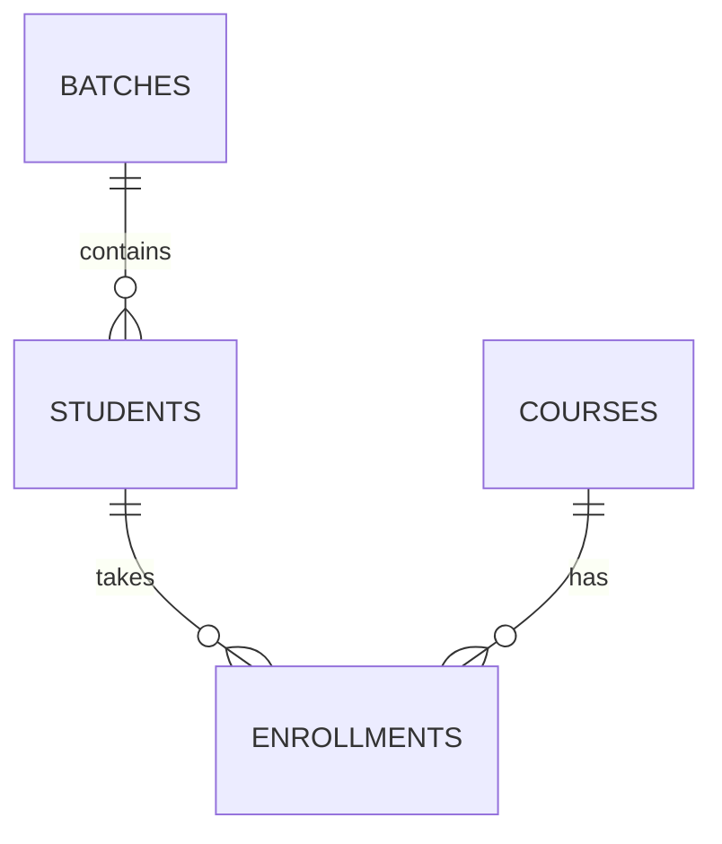

# Data Modeling & Database Design - Interview Revision Notes

> **Rule:** learn each topic as **Not to do -> True approach**. Notes are short, corrected, and ordered from fundamentals to production design.

## Contents

1. [Foundations](#1-foundations)
2. [Entities and attributes](#2-entities-and-attributes)
3. [Keys](#3-keys)
4. [Relationships and schema design](#4-relationships-and-schema-design)
5. [Normalization](#5-normalization)
6. [Transactions, ACID, and WAL](#6-transactions-acid-and-wal)
7. [Isolation and concurrency](#7-isolation-and-concurrency)
8. [Deletion and data lifecycle](#8-deletion-and-data-lifecycle)
9. [Indexes and query execution](#9-indexes-and-query-execution)
10. [SQL query patterns](#10-sql-query-patterns)
11. [Telemetry, scaling, and operations](#11-telemetry-scaling-and-operations)
12. [Comparison tables and checklist](#12-comparison-tables-and-checklist)

## Accuracy labels

- ✅ **Correct** - portable core rule.
- 🟡 **Incomplete** - needs the stated nuance.
- ⚙️ **Engine-specific** - PostgreSQL, MySQL, SQL Server, Oracle, etc. differ.
- ❌ **Incorrect** - do not use in an interview.

---

## 1. Foundations

### Simple Definition

- **Data modeling:** organize business facts so reads, writes, relationships, and change are safe.
- **Database:** persistent related data.
- **DBMS:** manages querying, constraints, concurrency, recovery, security, and storage.
- **RDBMS:** stores related tables and usually supports SQL and transactions.

### False Understanding

- ❌ "Data modeling is drawing tables quickly."
- ❌ "A database is a large spreadsheet."

### True Understanding

- Model **facts, ownership, rules, lifecycle, and access patterns** - not API screens.
- A DBMS adds constraints, access control, concurrent writes, recovery, and query planning.
- ✅ Relational and document/key-value databases are tools; use the data shape and consistency needs to choose.

### Real-World Analogy

- A spreadsheet is a notebook. A DBMS is a bank ledger with guards, rules, recovery, and controlled access.

### Example

1. Requirement: sell products and retain orders.
2. Facts: customer, product, order, item, price paid.
3. Rule: each order item must reference a real product.
4. Tables: `customers`, `products`, `orders`, `order_items`.

### Why It Matters

- Prevents duplication, invalid references, and expensive redesign.

### Common Mistakes

- Designing before asking why data exists, how long it lives, and who changes it.

### Interview Answer

> "Data modeling converts business facts and invariants into entities, relationships, and constraints, then optimizes the important access paths."

### Senior-Level Insight

- **OLTP:** short, concurrent transactions. **OLAP:** large scans/aggregates. **HTAP:** both, with strict resource isolation.

### Remember Forever

> **A schema is executable business policy.**

---

## 2. Entities and Attributes

### Simple Definition

- **Entity:** distinguishable object/concept, e.g. product or order.
- **Entity type:** collection of similar entities; often a table.
- **Attribute:** fact describing an entity; often a column.

### False Understanding

- ❌ "A table is an entity."
- ❌ "Every noun becomes a table."
- ❌ "A list in one string is a multivalued attribute solution."

### True Understanding

- Table ≈ entity type; row ≈ entity; column ≈ attribute.
- Create an entity when it has identity, lifecycle, independent attributes, or relationships.
- Attribute dimensions:
  - simple: `status`; composite: address parts;
  - single-valued: DOB; multi-valued: phones/emails;
  - derived: age from DOB.

### Real-World Analogy

- `Product` is the category; onion and potato are individual entities. Address is one label to a courier but separate facts for delivery/tax.

### Example

1. Product: onion ₹30/kg, potato ₹40/kg.
2. Type: `products`; rows: onion/potato.
3. Attributes: `id`, `name`, `price`, `available_quantity`.
4. Multiple emails -> `customer_emails(customer_id, email)`, not comma-separated text.

```sql
CREATE TABLE products (
 id bigint GENERATED ALWAYS AS IDENTITY PRIMARY KEY,
 name text NOT NULL, price numeric(12,2) CHECK (price >= 0),
 available_quantity int NOT NULL CHECK (available_quantity >= 0)
);
```

### Why It Matters

- Atomic, owned facts make constraints, indexes, and analytics reliable.

### Common Mistakes

- Store `age` rather than DOB; split every attribute even when parts have no use.

### Interview Answer

> "An entity has identity and lifecycle; an attribute describes it. I extract a table when a value is independently queried, repeated, related, or historical."

### Senior-Level Insight

- 🟡 Store derived data only for measured read performance; keep source fields and a rebuild/update path.

### Remember Forever

> **Store stable causes; derive changing effects.**

---

## 3. Keys

### Simple Definition

- **Super key:** any unique column set.
- **Candidate key:** minimal super key.
- **Primary key:** one chosen candidate key; unique + `NOT NULL`.
- **Foreign key:** child reference to parent key.
- **Surrogate key:** system-generated; **natural key:** business identity.

### False Understanding

- ❌ "Candidate key means one column."
- ❌ "All unique combinations are candidate keys."
- ❌ "Integer PK is always best."

### True Understanding

- `roll_no + name` is a super key, not candidate, if `roll_no` alone is unique.
- Composite candidate keys are valid when every part is necessary.
- Prefer stable, compact, system-controlled PKs; retain business identity with `UNIQUE`.
- ⚙️ UUIDs are useful for distributed ID generation; random UUIDs may fragment B-tree layouts. Ordered UUIDv7/ULID-like values often help.

### Real-World Analogy

- A passport identifies a person; a hotel still issues its own stable room-card ID for internal operations.

### Example

1. `student_id`, `email`, `roll_no` identify a student.
2. Choose `student_id` PK.
3. Keep `UNIQUE(email)` and `UNIQUE(roll_no)`.

```sql
CREATE TABLE students (
 student_id uuid PRIMARY KEY, email text UNIQUE NOT NULL,
 roll_no text UNIQUE NOT NULL, name text NOT NULL
);
```

### Why It Matters

- Keys are joined, indexed, replicated, and referenced everywhere.

### Common Mistakes

- Use mutable email/phone as only PK; omit business uniqueness after adding an ID.

### Interview Answer

> "Candidate means minimal unique; primary means chosen. I use a stable surrogate PK and enforce important natural identity separately."

### Senior-Level Insight

- ⚙️ PK clustering is not portable: InnoDB stores by PK; SQL Server can cluster another index; PostgreSQL does not automatically cluster table storage by PK.

### Remember Forever

> **Unique finds it; minimal qualifies it; chosen makes it primary.**

---

## 4. Relationships and Schema Design

### Simple Definition

- **1:1:** FK + `UNIQUE` on one side.
- **1:N:** one-side key is stored on many side.
- **M:N:** junction table.
- **Self-reference:** FK points to same table.
- **History:** dated relationship table.

### False Understanding

- ❌ "Store multiple IDs in one comma-separated field."
- ❌ "Current FK also stores relationship history."

### True Understanding

- Ask both ways: one A relates to how many B, and vice versa.
- M:N relation facts belong on the mapping table.
- `students.buddy_id` can self-reference `students(id)`.
- Use `student_batch_history` when movement over time matters.

### Real-World Analogy

- A class register links students and courses and can carry attendance/grade; it is more than a list of IDs.

### Example

1. Batch has many students -> `students.batch_id`.
2. Student takes many courses; course has many students -> junction.
3. Batch transfer -> append dated history row.

```sql
CREATE TABLE enrollments (
 student_id uuid REFERENCES students(student_id), course_id uuid REFERENCES courses(id),
 enrolled_at timestamptz NOT NULL DEFAULT now(), PRIMARY KEY(student_id, course_id)
);
```



### Why It Matters

- Enforces real business rules and prevents update drift.

### Common Mistakes

- Forget optionality; put relationship facts on parent; replace history with overwrite.

### Interview Answer

> "1:N puts the FK on the many side, M:N needs a junction table, and a changing relationship needs a dated association table."

### Senior-Level Insight

- Requirements -> nouns -> direct attributes -> keys -> cardinality -> constraints -> query paths.
- A noun becomes a table only with identity, reuse, lifecycle, or meaningful attributes. Use lookup tables for controlled values like `batch_types`.

### Remember Forever

> **If a relationship has facts or history, it deserves a table.**

---

## 5. Normalization

### Simple Definition

- Reduce unnecessary repeated mutable facts and anomalies.
- **1NF:** atomic cell values. **2NF:** no partial dependency on composite key. **3NF:** no non-key -> non-key dependency. **BCNF:** every determinant is a candidate key.

### False Understanding

- ❌ "Normalization is a mandatory SQL rule."
- ❌ "More tables are always slower."

### True Understanding

- ✅ It is a design guideline. Normalize mutable truth first; denormalize measured reads deliberately.
- **Redundancy** is duplicate fact; **anomaly** is bad insert/update/delete result.

### Real-World Analogy

- Do not print an instructor's contact detail on every enrollment form; one correction should happen once.

### Example

1. Bad: `enrollment(student_id, course_id, student_name, course_name, instructor_id, instructor_name)`.
2. Key `(student_id, course_id)`.
3. `course_name` depends only on `course_id` -> 2NF issue.
4. `instructor_id -> instructor_name` -> 3NF issue.
5. Split `students`, `courses`, `instructors`, `enrollments`.

### Why It Matters

- Insert anomaly: cannot add course without fake enrollment.
- Update anomaly: instructor name changes in many rows.
- Delete anomaly: remove last student and lose course.

### Common Mistakes

- Normalize immutable purchase price away; duplicate mutable customer data without owner.

### Interview Answer

> "I aim for 3NF so each mutable fact has an owner, then denormalize only for measured read needs with refresh, reconciliation, and rebuild plans."

### Senior-Level Insight

- Good duplication: `order_items.unit_price` purchase snapshot, materialized view, read model. Bad: customer address copied through ten mutable tables.

### Remember Forever

> **Normalize truth; denormalize projections.**

---

## 6. Transactions, ACID, and WAL

### Simple Definition

- Transaction: one logical unit of work.
- ACID: **Atomicity**, **Consistency**, **Isolation**, **Durability**.
- WAL: engine recovery log written before required durable page effects.

### False Understanding

- ❌ "ACID makes every microservice flow globally atomic."
- ❌ "WAL is an application table."
- ❌ "Durable means data can never be lost."

### True Understanding

- Atomic: all or nothing. Consistency: constraints/invariants stay valid. Isolation: controlled concurrency. Durability: acknowledged commit survives promised failures.
- ⚙️ WAL/checkpoint recovery details differ by engine; WAL is internal, not business event storage.

### Real-World Analogy

- Warehouse writes a durable operations journal before changing shelf counts; restart uses it to recover.

### Example

1. Begin transfer.
2. Debit only if balance sufficient.
3. Credit recipient.
4. Write ledger; commit or rollback all.

```sql
BEGIN;
UPDATE accounts SET balance=balance-100 WHERE id=:from AND balance>=100;
UPDATE accounts SET balance=balance+100 WHERE id=:to;
COMMIT;
```

### Why It Matters

- Stops partial payments, reservations, and crash corruption.

### Common Mistakes

- Long transaction around remote HTTP; assume replica is backup.

### Interview Answer

> "A transaction is a local consistency boundary. WAL supports crash recovery; cross-service work needs idempotency, outbox, and compensation."

### Senior-Level Insight

- Transactional outbox persists state/event atomically; saga uses local transactions and compensations; 2PC trades availability for coordination.

### Remember Forever

> **Commit is a promise with a failure model.**

---

## 7. Isolation and Concurrency

### Simple Definition

- Levels control anomalies: dirty/non-repeatable reads, phantoms, lost updates, write skew.

### False Understanding

- ❌ "Isolation prevents parallel execution."
- ❌ "Serializable means no retry and no cost."

### True Understanding

- Concurrent transactions run; level controls interference.
- ⚙️ Semantics vary: PostgreSQL treats read-uncommitted as read-committed; validate engine defaults/configuration.
- Serializable can block or abort; retry safely.

### Real-World Analogy

- Two agents see the last seat; concurrency control prevents both selling it.

### Example

1. Do not select stock then decrement in app.
2. Conditional atomic update.
3. Check rows affected.

```sql
UPDATE show_seats SET available=available-1
WHERE show_id=:show AND seat_no=:seat AND available>0;
```

### Why It Matters

- Protects money, inventory, quota, and booking invariants.

### Common Mistakes

- Long locks, inconsistent lock order, no idempotency/retry.

### Interview Answer

> "I choose isolation from the invariant. Scarce inventory uses an atomic conditional write or short lock, checked row count, and idempotent retry."

### Senior-Level Insight

- Optimistic locking: version/CAS, rare conflicts. Pessimistic locking: short reservation, high contention. Constraints still matter.

### Remember Forever

> **Concurrency bugs are business-rule bugs happening together.**

---

## 8. Deletion and Data Lifecycle

### Simple Definition

- Hard delete removes row. Soft delete retains it with `deleted_at`/status. Retention defines archive/purge/erasure rules.

### False Understanding

- ❌ "`is_deleted` solves deletion automatically."
- ❌ "Outer joins fix orphaned foreign keys."

### True Understanding

- Soft deletion changes every query, unique rule, cache, job, report, and permission check.
- FKs normally prevent or define deletion behavior (`RESTRICT`, `CASCADE`, `SET NULL`).
- Privacy erasure may remove/pseudonymize PII while keeping lawful financial history.

### Real-World Analogy

- Soft delete is archiving a file; hard delete is shredding it; retention decides when shredding is legal.

### Example

1. Customer has retained orders.
2. Mark `deleted_at`, disable active account.
3. Preserve order snapshots/ledger.
4. Purge/mask PII under policy.

### Why It Matters

- Preserves audit/reconciliation without leaking deleted users into active flows.

### Common Mistakes

- Forget deleted filter; use cascades on financial history; never test restore/purge.

### Interview Answer

> "Deletion is lifecycle design: I state retention, FK action, query defaults, uniqueness behavior, restore, and privacy-erasure policy."

### Senior-Level Insight

- ⚙️ Partial unique index example is PostgreSQL-specific: `UNIQUE(email) WHERE deleted_at IS NULL`.

### Remember Forever

> **Deleted is a business state before it is SQL.**

---

## 9. Indexes and Query Execution

### Simple Definition

- Index: access structure; B+ tree is common. Full scan reads a table's pages broadly, not the entire disk. Optimizer chooses plan.

### False Understanding

- ❌ "Full scan is always bad." ❌ "Index every column." ❌ "PK is always clustered."

### True Understanding

- Scan can be cheapest for small tables/high result percentage.
- Indexes speed reads but cost writes, disk, cache, and maintenance.
- Query flow: parse -> semantic validation -> optimize -> execute -> return.
- ⚙️ clustered/non-clustered implementation differs by engine.

### Real-World Analogy

- Book index finds one word; for 90% of book, reading pages is cheaper.

### Example

1. Endpoint: latest 50 orders for customer.
2. Filter by customer, order by creation time.
3. Add composite index; inspect actual plan.

```sql
CREATE INDEX orders_customer_created_idx ON orders(customer_id, created_at DESC);
```

### Why It Matters

- Prevents database saturation and slow endpoints.

### Common Mistakes

- Index low-selectivity flags blindly; ignore composite leftmost prefix; skip `EXPLAIN`.

### Interview Answer

> "I index query shapes: equality prefix, range/order, selectivity, result size, and write ratio. I validate with actual execution plans."

### Senior-Level Insight

- Covering/index-only, included columns, hash indexes, work memory, and clustering are engine-specific details.

### Remember Forever

> **Faster reads are purchased with slower writes.**

---

## 10. SQL Query Patterns

### Simple Definition

- Inner join: matches both; left join: all left rows. `WHERE` filters rows; `HAVING` filters groups. `ORDER BY` guarantees order.

### False Understanding

- ❌ "SQL returns insertion order." ❌ "WHERE equals HAVING." ❌ "Deep OFFSET is cheap."

### True Understanding

- Join algorithm (nested loop/hash/merge) is plan-dependent.
- Filter before grouping with `WHERE`; aggregate filter with `HAVING`.
- Use cursor/keyset pagination for deep lists; prevent N+1 with batched query/join.

### Real-World Analogy

- `WHERE` removes players before teams form; `HAVING` removes teams after average score is calculated.

### Example

```sql
SELECT department_id, AVG(salary) AS avg_salary
FROM employees WHERE employment_status='active'
GROUP BY department_id HAVING AVG(salary)>100000;
```

### Why It Matters

- Correct SQL at low volume can be unusable at production scale.

### Common Mistakes

- `SELECT *`; count outer-join placeholders; no deterministic order for pages.

### Interview Answer

> "I filter early, join declared keys, group only needed rows, use HAVING for aggregate rules, and use cursor pagination for large feeds."

### Senior-Level Insight

- Connection pools add backpressure; more connections can overload DB. Monitor query count, pool waits, lock waits, and plan regressions.

### Remember Forever

> **Correct SQL answers now; planned SQL survives traffic.**

---

## 11. Telemetry, Scaling, and Operations

### Simple Definition

- Current state = latest value; history = timestamped events. Partitioning splits logical tables; sharding distributes nodes; replication copies data.

### False Understanding

- ❌ "Collect every minute because more data is always better."
- ❌ "A cron cleanup job needs no guarantees."

### True Understanding

- Sampling follows product goal, latency, battery, volume, and retention.
- Split model -> variant -> physical device -> ownership -> telemetry.
- Store current projection separately when live reads need it; archive via idempotent, monitored jobs.

### Real-World Analogy

- Live map needs current location; investigation needs travel diary.

### Example

1. Ask: latest state, history, or both?
2. Device sends GPS/battery every 5 min; 10 min when battery low.
3. Insert history; upsert latest state.
4. Partition/archive old readings by retention rule.

```sql
CREATE TABLE device_telemetry (
 device_id uuid NOT NULL REFERENCES devices(id), captured_at timestamptz NOT NULL,
 latitude numeric(9,6), longitude numeric(9,6),
 battery_percent smallint CHECK(battery_percent BETWEEN 0 AND 100),
 PRIMARY KEY(device_id, captured_at)
);
```

### Why It Matters

- Prevents time-series growth from damaging live operations.

### Common Mistakes

- Mix model, variant, physical device, owner, and telemetry; archive without verification; treat replica as backup.

### Interview Answer

> "I separate identity from time-series facts, choose frequency and retention from use case, and use partitioning/archive only when volume makes it necessary."

### Senior-Level Insight

- Partition for pruning/manageability; shard only after one DB boundary fails; replicate for availability/read locality. Backups need tested restore, RPO, and RTO.

### Remember Forever

> **Timestamped data is an event; current state is a projection.**

---

## 12. Comparison Tables and Checklist

### Keys

| Term | Rule | Example |
| --- | --- | --- |
| Super key | Unique, extras allowed | `student_id + email` |
| Candidate key | Unique + minimal | `student_id` |
| PK | Chosen candidate | `students.student_id` |
| FK | References parent | `orders.customer_id` |

### Relationship placement

| Cardinality | Storage |
| --- | --- |
| 1:1 | FK + `UNIQUE` on either side |
| 1:N | FK on many side |
| M:N | Junction table |
| History | Dated association table |

### Before ending a schema interview

- [ ] Clarify use case, scale, retention, consistency, and assumptions.
- [ ] Explain entity vs attribute and every cardinality decision.
- [ ] Add PK, natural uniqueness, FK, `NOT NULL`, `CHECK`, lifecycle rules.
- [ ] Normalize mutable truth; justify snapshots/duplicates.
- [ ] Name critical query shapes, indexes, and write trade-offs.
- [ ] Explain concurrency for inventory/money/booking.
- [ ] Mark engine-specific claims and cover migration, backup/restore, monitoring, archive/purge.

## Corrections from source notes

- ✅ Table represents an entity **type**; row is an entity.
- 🟡 Integer PK is a common preference, not universal; UUID design is workload-specific.
- ❌ PK is not universally a clustered index.
- 🟡 ACID and isolation behavior depend on engine, configuration, and transaction boundary.
- ❌ WAL is not an application table or permanent event archive.
